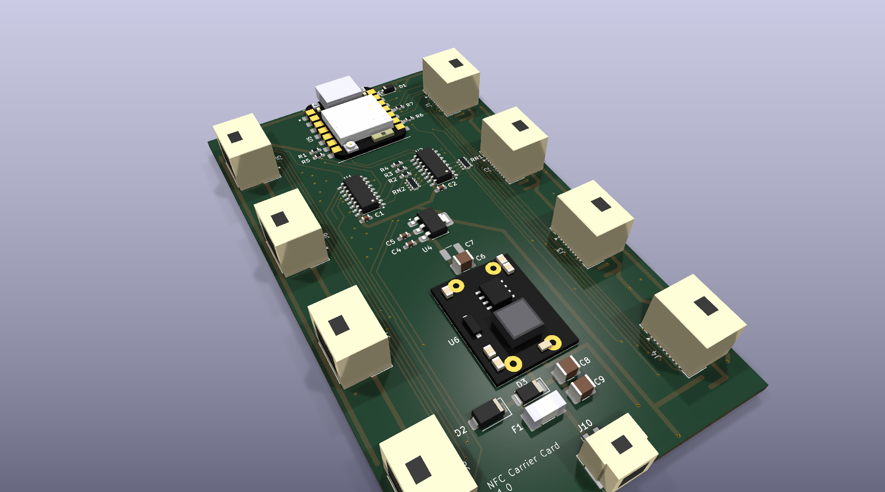

# PN5180 8-Bay NFC Reader Carrier

Carrier board that lets 4 or 8 PN5180 breakout modules plug in over ~30 cm cables with
Molex CLIK-Mate 1.50 mm dual-row (2×5) positive-lock connectors (CLIK-Mate is the white
latching family used on the Prusa LoveBoard) and share one SPI bus with a Seeed Studio
XIAO ESP32C6 socketed at the top centre of the board. It runs from the printer's 24 V supply through an MP1584EN buck
module soldered flat onto the carrier. Every part is SMD except the buck module's four
through-hole pads; the XIAO is soldered flat by its castellations. A 74HC138 decodes
3 address lines into the 8 chip selects; a 74HC151 muxes the 8 BUSY lines back to a
single GPIO. The PN5180's IRQ pin is not used — BUSY is the only handshake the SPI
protocol needs.

**GPIO cost: 9 of the XIAO's 11 pins** — SCK, MOSI, MISO, A0, A1, A2, /EN, BUSY, /RST.
D6 and D7 are spare.

Author: hyiger · Rev 1.4 · KiCad 10 files (saved with 10.0.6; KiCad 9 and older cannot open them)



## Files

| File | Purpose |
|---|---|
| `pn5180_carrier.kicad_pro` | Project file — open this in KiCad 10 |
| `pn5180_carrier.kicad_sch` | Schematic (single A3 sheet, all symbols embedded) |
| `pn5180_carrier.kicad_pcb` | 2-layer PCB, 62.5 × 106.5 mm. Layout in progress: J1–J8 now carry the 2×5 503148-1090 footprints (swapped 2026-09-05) but their tracks still need re-routing; a few other nets unrouted; mounting holes not yet placed. All 35 footprints reference a 3D model |
| `carrier.kicad_sym` + `sym-lib-table` | Project-local symbol library (same symbols, for editing) |
| `carrier.pretty/` + `fp-lib-table` | Project-local footprints: the XIAO castellated SMD pattern (plus the older 2×7-socket version, geometry from Seeed's OPL library), the MP1584EN module pads, the CLIK-Mate 503148-1090 2×5 receptacle (from Molex's catalog drawing — KiCad ships no dual-row CLIK-Mate footprint), and copies of the stock 502494-0270 (J10) and NANO2 (F1) footprints that differ only in pointing at a project 3D model |
| `pn5180_carrier_schematic.pdf` / `.png` | Rendered schematic, no KiCad needed |
| `pn5180_carrier_bom.csv` | Full BOM: refs, qty, MPN, Mouser #, footprint, DNP flag |
| `pn5180_carrier_mouser_order.csv` | One-board order list for Mouser's BOM tool (populated parts and cable-side parts with spare terminals) |
| `gerbers/`, `gerbers.zip` | Preview gerber/drill export of the unfinished layout, still with the 1×10 connectors — not a fab package |
| `check_netlist.py` | Asserts the exported netlist against the intended connectivity (`kicad-cli sch export netlist --format kicadsexpr -o net.txt pn5180_carrier.kicad_sch`, then `python3 check_netlist.py net.txt`) |
| `gen_kicad.py` | Historical generator that produced the schematic, symbol library, footprints and BOM through rev 1.3 (KiCad 7 format). The KiCad files have been hand-edited since and are authoritative — don't re-run it over them |
| `CLAUDE.md`, `MEMORY.md` | Design guide and decision log: verified part data, layout state, ERC/DRC baseline, open items |
| `.gitignore` | Keeps KiCad's transient files (`.history/`, `.kicad_prl`, lock files), kicad-cli check outputs and `renders/` out of git |
| `carrier.3dshapes/` | Simplified VRML 3D models (boxes with the right envelopes and colours) for the parts KiCad ships no model for: the 2×5 and 1×2 CLIK-Mate receptacles, the XIAO (flat, plus a socketed variant), the MP1584EN module (black no-trimmer type), the NANO2 fuse. Generated by `tools/gen_3d_models.py`; drop in vendor STEP files when you have them |
| `tools/` | `gen_clikmate_2x5_fp.py` (the 503148-1090 footprint), `gen_3d_models.py` (the models above), `render_3d_preview.py` (top, isometric and close-up PNGs of the board via `kicad-cli pcb render`; run with KiCad's bundled Python) |
| `pn5180_carrier_3d_preview.png` | Rendered 3D view of the board with those models |

Footprints reference the stock KiCad libraries and every name was verified against
the 10.0 library set (`Capacitor_SMD`, `Diode_SMD`, `Package_SO`, `Resistor_SMD`, …). If a newer
library renames one, reassign it in the footprint tool — nothing in the netlist
depends on the footprint. Command-line checks use KiCad's `kicad-cli`: `sch erc`,
`pcb drc --schematic-parity`, and `sch export netlist` followed by `check_netlist.py`.

## Connector pinouts

### J1–J8: bay connectors (Molex 503148-1090, CLIK-Mate 1.50 mm 2×5 dual-row right-angle SMT)

Build cables by Molex circuit number: cavity *n* of the 503149-1000 housing is signal *n*,
and signals 1–9 follow the first nine positions of the common red PN5180 module's header,
so the module end is a straight 1-to-9 run plus the second GND (cavity 10 into the same
module GND as cavity 9). Molex's catalog drawings number the two rows as stacked pairs —
odd circuits (1, 3, 5, 7, 9) in one row, even (2, 4, 6, 8, 10) in the other — which puts
5V over 3V3, /RST over NSS, MOSI over MISO, SCK over BUSY and the two GNDs in the last
column. That pairing and the receptacle's lead order are read off the drawings rather than
dimensioned, so before crimping the first cable confirm on Molex's 503149/503148 sales
drawings which end is circuit 1 (and from which face the drawing looks), which row carries
the odd circuits, and the 502579 terminal's insertion orientation. On the PCB the
receptacle's ten leads come out in one 0.75 mm-pitch line, numbered 1 to 10 from the pin-1
end (chamfer and triangle on the footprint), offset half a pitch toward pin 10 because the
even-row tails jog sideways. Pin 10 is a second GND: run it as a separate wire twisted with
SCK and crimp both returns into the module's GND at the far end, which tightens the SCK
return loop over the 30 cm. Verify the module's header order before building cables.

| Pin | Signal | Notes |
|---|---|---|
| 1 | 5V | From carrier 5V rail (module TVDD / RF power) |
| 2 | 3V3 | From the carrier LDO (U4), direct |
| 3 | /RST | Shared by all bays |
| 4 | NSS | Bay-specific, from 74HC138 output *n* |
| 5 | MOSI | Shared |
| 6 | MISO | Shared (module tri-states when NSS high) |
| 7 | SCK | Shared |
| 8 | BUSY | Bay-specific, to 74HC151 input *n*, 100k pull-down (RN1/RN2) |
| 9 | GND | |
| 10 | GND | Second return — twist with SCK in the harness |

Bay *n* ↔ J(n+1) ↔ 74HC138 Y*n* ↔ 74HC151 D*n*. Bay 0 is address 000, bay 7 is 111.

Most PN5180 modules expect both 5 V and 3.3 V supplied (3.3 V for VBAT/PVDD, 5 V for the
RF stage), so the carrier feeds both. If your modules regulate 3.3 V onboard and drive
that pin as an *output*, leave pin 2 out of the cable rather than paralleling two LDOs.

### U5: Seeed XIAO ESP32C6, soldered flat on castellated pads

Pin numbers follow Seeed's own symbol/footprint: 1–11 = D0–D10, 12 = 3V3 out, 13 = GND,
14 = 5V (USB VBUS). Pins 1 (D0) and 14 (5V) are at the USB end. The footprint
(`carrier:Seeed_XIAO_ESP32C6_SMD`) puts 14 SMD pads of 1.5 × 2.5 mm under the module's
castellations (2.54 mm pitch, rows 17.8 mm apart, extending 1.25 mm past the module edge
for the fillet) and carries the 21 × 17.8 mm outline, the USB-C overhang and an antenna
marker — place the XIAO with the USB end at the carrier's top edge and the antenna end
inboard, and keep copper off both layers under the antenna end. The socketed alternative
(`Seeed_XIAO_2x7_Socket`, two Würth 61300711821 1×7 headers) stays in the library.

| Signal | XIAO pin | Symbol pin | GPIO* | Note |
|---|---|---|---|---|
| SCK | D8 | 9 | 19 | hardware SPI SCK, via R6 33 Ω |
| MISO | D9 | 10 | 20 | hardware SPI MISO |
| MOSI | D10 | 11 | 18 | hardware SPI MOSI, via R7 33 Ω |
| /EN | D3 | 4 | 21 | → 74HC138 /E1 (acts as NSS) |
| A0 | D0 | 1 | 0 | |
| A1 | D1 | 2 | 1 | |
| A2 | D2 | 3 | 2 | |
| BUSY | D4 | 5 | 22 | 74HC151 output (I²C SDA pin, unused as such) |
| /RST | D5 | 6 | 23 | shared reset to all bays |
| spare | D6 | 7 | 16 | NC (UART0 TX) |
| spare | D7 | 8 | 17 | NC (UART0 RX) |
| 3V3 out | — | 12 | | NC — the carrier has its own 3V3 LDO |
| GND | — | 13 | | |
| 5V | — | 14 | | from carrier 5V through D1 |

\* GPIO numbers per Seeed's pin diagram; write firmware with the `D0…D10` names from the
board's `pins_arduino.h` and they can't be wrong. `SPI.begin()` with no arguments uses
D8/D9/D10.

**Power path:** Seeed states the XIAO's 5V pin is the raw USB VBUS and that an external
supply must go through a diode. D1 (PMEG2010AEH, 0.3 V drop at our current) does that, so
USB can stay plugged in for flashing while the carrier is powered — neither source can
push into the other. The XIAO's own LDO makes its 3.3 V from ~4.7 V; that's fine. With the
carrier unpowered, USB alone runs the XIAO and D1 keeps VBUS out of the carrier's 5 V rail.

### J10: 24 V input (Molex 502494-0270, CLIK-Mate 2.00 mm 1×2 right-angle SMT)

| Pin | Signal |
|---|---|
| 1 | +24 V from the printer PSU |
| 2 | GND (printer PSU return) |

**Tapping the Core One.** Take it from the PSU's 24 V output terminals — put a crimped
fork/spade terminal under the existing screw next to the xBuddy's lead, positive and
return together, 22 AWG is plenty. Check polarity with a meter before you plug the
carrier in; the connector is keyed but the PSU end isn't. Load is ≤ ~0.4 A at 24 V worst
case (the module's 1.5 A limit at 5 V), typically well under that, so the PSU's headroom
is not a concern. The xBuddy's MMU port also carries firmware-switched 24 V, but it's only
enabled when an MMU is configured, so the PSU terminals are the practical tap.

**Input stage (all on the carrier):** F1 1 A slow-blow → D2 SMAJ28A TVS (clamps motor
regen spikes; a reversed input forward-biases it and blows F1) → D3 PMEG6030EP reverse
Schottky (keeps the reversed input off C8/C9 and the module; F1 still blows through D2,
so replace it after fixing the miswire) → C8/C9 2 × 10 µF 50 V → U6.

**Buck (U6): MP1584EN mini module, mounted flat.** The footprint has four 3 mm
through-hole pads on the module's 18.54 × 8.13 mm pad rectangle; lay the module on the
carrier and solder down through its own plated holes, or stand it on four header-pin
stubs — both work on the same pads. IN pads at the "IN" silk end, OUT at "OUT", "+" marks
the top row. Module pad labels vary between makers, so check the module's own silkscreen
against the footprint before soldering.

Three things about this module on a 24 V rail:

- It's rated 28 V max. The TVS (28 V standoff, clamping from ~31 V) and C8/C9 are what
  keep spikes off it — don't leave them out to save parts.
- It's adjustable. **Set the pot to 5.00 V with a meter before mounting it**, then lock
  the pot with a dab of nail varnish. A bumped pot puts up to 20 V into the readers and
  the XIAO. If you can get a fixed-5 V variant, prefer it.
- The seller's own guidance is 1.5 A continuous without a heatsink. The carrier's real
  draw is well under 1 A (one RF field at a time), so that's fine; give it some copper
  under the pads anyway.

### Cables (~30 cm)

Bay cable: 503149-1000 dual-row housing at the carrier with 10 × 502579 terminals on
24–28 AWG stranded wire — the terminal takes insulation of 0.78–1.28 mm OD, so use
thin-wall UL1061/UL1571-type wire and check the specific wire's maximum OD against 1.28 mm
(common UL1007 24 AWG at ~1.5 mm is too fat, and some UL1061 24 AWG is specified at
1.3 mm); 24 AWG for 5V/GND is plenty at ≤ 0.25 A per bay — and a 2.54 mm DuPont-style
female on the module end (or solder to the module header). Power: the 24 V cable stays on the 2.00 mm family, 502439-0200 housing
with 502438 terminals on 22 AWG. The XIAO is socketed on the carrier, so bay and power
cables are the only cables.

The housing latches inside the receptacle (the CLIK; one inner lock on the 10-circuit
housing) and releases with a squeeze — no tools. Molex's hand crimpers are expensive
(distributor listings name 200218-7400 for the 1.50 mm 502579 and 63819-2800 for the
2.00 mm 502438 — not checked against Molex's tooling spec); both are small open-barrel
terminals and a small-barrel ratchet crimper (Engineer PA-09 or an IWISS SN-01BM-class
tool) does the job — pull-test the first few crimps, because with 24–28 AWG in a 1.5 mm
terminal the tool is what makes or breaks a cable. Molex also sells pre-crimped CLIK-Mate 1.50 leads
(79758-1011: 300 mm, 24 AWG UL1061, terminal on both ends, packs of 10 at RS) — cut one
end off and solder it to the module header if you'd rather skip crimping.

Eight 30 cm unterminated stubs hanging off one SPI bus is a real transmission-line load,
so the design takes three precautions:

- **R6/R7 (33 Ω) in series with SCK and MOSI**, a few mm from the ESP32 socket pins and
  before the bus fans out — proper source termination for the star, taking the edge off
  the ESP32's ~2 ns rise times. Fit 0 Ω if you scope it and it's clean; 47–68 Ω if you
  see ringing.
- **SPI clock ≤ 1 MHz.** The PN5180 doesn't need more for inventory polling, and a 1 µs
  bit period gives the reflections on a 30 cm stub (a few ns round trip) time to settle.
- **Lowest ESP32 drive strength that works:** `gpio_set_drive_capability((gpio_num_t)D8,
  GPIO_DRIVE_CAP_0)` (and `D10` for MOSI) slows the edges further.

Route GND wires as close to SCK as the harness allows. MISO is driven by the PN5180 (slower
edges) and needs nothing extra. NSS/BUSY see one stub each and are fine.

## How the selection logic works

- `A0..A2` → 74HC138 address inputs **and** both 74HC151 select inputs.
- `/EN` → 74HC138 `/E1` (G2A). Low = the addressed bay's NSS goes low; high = every NSS high.
  Wire the library's "NSS" pin to `/EN` and it just works — the library toggles NSS,
  the decoder routes it.
- `BUSY` (XIAO D4, symbol pin 5) is the 74HC151 output = the BUSY of the addressed bay. Wire
  it to the library's "BUSY" pin.
- `/E2` is grounded, `E3` tied high; 74HC151 `/E` grounded (always enabled).
- R6/R7 sit between the ESP32 and the SCK/MOSI bus (nets `SCK_IN`/`MOSI_IN` on the ESP32 side).
- Pull-ups on `/EN` and `/RST` and pull-downs on `A0..A2` define everything while the
  ESP32 is booting or unplugged. The 4×100k arrays RN1/RN2 keep unfitted bays' BUSY
  inputs from floating. Bay *n* uses element (*n* mod 4)+1 of RN(1 + *n*÷4): pin
  (*n* mod 4)+1 to the signal and its opposite pin (8, 7, 6, 5) to GND — the standard
  1–8/2–7/3–6/4–5 pairing.

**Rule:** change `A0..A2` only while `/EN` is high, or two NSS lines can glitch low
during the decoder transition.

## Firmware sketch (ATrappmann PN5180 library)

```cpp
// Seeed XIAO ESP32C6 in the carrier sockets (Arduino-ESP32 core 3.x, board "XIAO_ESP32C6")
#define PIN_A0   D0
#define PIN_A1   D1
#define PIN_A2   D2
#define PIN_EN   D3     // -> 74HC138 /E1, acts as "NSS" for the addressed bay
#define PIN_BUSY D4     // <- 74HC151 Y
#define PIN_RST  D5
#define BAYS      8     // 4 for a half-populated board
// SCK D8 / MISO D9 / MOSI D10 are the board's hardware SPI pins

PN5180ISO15693 nfc(PIN_EN, PIN_BUSY, PIN_RST);   // one instance for all bays

void selectBay(uint8_t n) {
  digitalWrite(PIN_EN, HIGH);            // deselect everything before changing address
  digitalWrite(PIN_A0, n & 1);
  digitalWrite(PIN_A1, (n >> 1) & 1);
  digitalWrite(PIN_A2, (n >> 2) & 1);
}

void setup() {
  pinMode(PIN_A0, OUTPUT); pinMode(PIN_A1, OUTPUT); pinMode(PIN_A2, OUTPUT);
  pinMode(PIN_EN, OUTPUT); digitalWrite(PIN_EN, HIGH);
  nfc.begin();                           // SPI on D8/D9/D10; keep the SPI clock <= 1 MHz
  gpio_set_drive_capability((gpio_num_t)D8,  GPIO_DRIVE_CAP_0);   // soften SCK/MOSI edges
  gpio_set_drive_capability((gpio_num_t)D10, GPIO_DRIVE_CAP_0);
  // shared /RST: pulse once, then finish the post-reset handshake per bay
  digitalWrite(PIN_RST, LOW);  delay(10);
  digitalWrite(PIN_RST, HIGH); delay(10);
  for (uint8_t b = 0; b < BAYS; b++) {
    selectBay(b);
    while (!(nfc.getIRQStatus() & IDLE_IRQ_STAT)) {}   // add a timeout in real code
    nfc.clearIRQStatus(0xFFFFFFFF);
  }
}

void loop() {
  for (uint8_t b = 0; b < BAYS; b++) {
    selectBay(b);
    nfc.setupRF();                       // RF on, this bay only
    uint8_t uid[8];
    bool present = (nfc.getInventory(uid) == ISO15693_EC_OK);
    nfc.setRF_off();                     // field off before moving to the next bay
    updateBay(b, present, uid);          // debounce: 2-3 misses before "removed"
  }
}
```

The stock library's `while (digitalRead(BUSY))` loops have no timeout; add one
(a few ms) so an empty bay or a wedged module can't hang the sweep.

## Layout notes

The 2-layer PCB in `pn5180_carrier.kicad_pcb` follows these rules; the current routing
state and the ERC/DRC baseline are tracked in `MEMORY.md`.

- Ground plane on one layer; SPI signals short, routed as a star or short daisy chain
  from U5 to the bay connectors. With 8 loads plus cable capacitance, ≤ 1 MHz SPI.
- U5 at the top centre, USB-C end at the top board edge (the rule is a 1–2 mm overhang;
  as placed it sits 0.45 mm inside), antenna end (opposite the USB) pointing inboard with
  a copper keep-out on both layers under it. The XIAO is soldered flat by its
  castellations (no sockets); it also has an external-antenna u.FL if the rack's metal
  gets in the way.
- Bay connectors down both long edges (J5–J8 left, J1–J4 right), in bay order, so cables
  don't cross. The 503148 receptacles are SMT: ten 0.55 mm signal pads at 0.75 mm pitch
  in one line at the rear (reflow, or drag-solder with plenty of flux) and two solder-nail
  pads ("MP" in the footprint) at the front corners — the nails, not the signal pins, take
  the cable-pull load, so give them full paste and don't thin the copper under them.
  Right-angle parts: the cable leaves flat along the board plane. The 2×5 body is 11.8 mm
  long against the old 1×10's 24.0 mm, so the connector columns can tighten up. **J1–J8
  were swapped to the 2×5 footprint on 2026-09-05** (same positions and orientations,
  nail pads outboard); their tracks still have to be re-routed, then refill zones, run
  DRC and regenerate the gerbers (CLAUDE.md open item 12).
- R6/R7 within a few mm of U5 pins 9/11 (D8 SCK / D10 MOSI), before the traces fan out.
- U1/U2 near U5 (short A0–A2, /EN, BUSY traces); the eight NSS/BUSY lines then run out
  to the connector edge.
- U6 module: C8/C9 right at its IN pads, a solid GND pour under it, and keep it away from
  the SPI lines and the XIAO's antenna (it switches at ~1.5 MHz with a small inductor).
- F1/D2/D3 near J10; C6/C7 and C4 near U4; C1/C2 within a few mm of their IC VCC pins.
- U4 (SOT-223) with a copper pour on the tab (tab = OUTPUT, part of the 3V3 net); at ~200 mA on 3V3 it dissipates ~0.35 W.
- M3 mounting holes are still to be added (not in the schematic).
- For a 4-bay build simply leave J5–J8 (and RN2) unpopulated. Firmware `BAYS = 4`.

## BOM (all SMD except U6's four pads)

Rev 1.4. Every symbol in the schematic carries `Manufacturer`, `MPN` and `Mouser` fields,
so KiCad's own BOM export reproduces this table. `pn5180_carrier_mouser_order.csv` can be
uploaded directly to Mouser's BOM tool.

| Ref | Qty | Part | Mouser # | Footprint |
|---|---|---|---|---|
| U1 | 1 | TI SN74HC138DR | 595-SN74HC138DR | Package_SO:SOIC-16_3.9x9.9mm_P1.27mm |
| U2 | 1 | TI SN74HC151DR | 595-SN74HC151DR | Package_SO:SOIC-16_3.9x9.9mm_P1.27mm |
| U4 | 1 | TI TLV1117LV33DCYR, 3.3 V 1 A ceramic-stable LDO | 595-TLV1117LV33DCYR | Package_TO_SOT_SMD:SOT-223-3_TabPin2 |
| J1–J8 | 8 | Molex 503148-1090, CLIK-Mate 1.50 mm dual-row RA SMT receptacle 2×5 (1 A/contact) | 538-503148-1090 | carrier:Molex_CLIK-Mate_503148-1090_2x05-1MP_P1.50mm_Horizontal |
| U5 | 1 | Seeed Studio XIAO ESP32C6 (SKU 113991182) — user-supplied, soldered flat | 713-113991182 (verify) | carrier:Seeed_XIAO_ESP32C6_SMD |
| D1 | 1 | Nexperia PMEG2010AEH, Schottky 20 V 1 A, SOD-123 | 771-PMEG2010AEH | Diode_SMD:D_SOD-123 |
| J10 | 1 | Molex 502494-0270, CLIK-Mate 2.00 mm RA SMT receptacle 1×2 (24 V in) | 538-502494-0270 | carrier:Molex_CLIK-Mate_502494-0270_1x02-1MP_P2.00mm_Horizontal (local copy of the stock footprint, with 3D model) |
| U6 | 1 | MP1584EN mini buck module, 22 × 17 mm, set to 5.0 V — user-supplied (Amazon) | — | carrier:MP1584EN_Module_22x17 |
| F1 | 1 | Littelfuse 0453001.MR, 1 A, NANO2 (451/453 is the fast-acting series — see open item 13) | 576-0453001.MR | carrier:Fuse_Littelfuse-NANO2-451_453 (local copy of the stock footprint, with 3D model) |
| D2 | 1 | Littelfuse SMAJ28A TVS, 28 V standoff, SMA | 576-SMAJ28A | Diode_SMD:D_SMA |
| D3 | 1 | Nexperia PMEG6030EP Schottky 60 V 3 A (reverse polarity) | 771-PMEG6030EP | Diode_SMD:D_SOD-128 |
| C8, C9 | 2 | Murata GRM32ER71H106KA12L, 10 µF 50 V X7R 1210 | 81-GRM32ER71H106KA12L | Capacitor_SMD:C_1210_3225Metric_Pad1.33x2.70mm_HandSolder |
| R1–R5 | 5 | Yageo RC0603FR-0710KL, 10k 1% 0603 | 603-RC0603FR-0710KL | Resistor_SMD:R_0603_1608Metric_Pad0.98x0.95mm_HandSolder |
| R6, R7 | 2 | Yageo RC0603FR-0733RL, 33 Ω 1% 0603 (SCK/MOSI series) | 603-RC0603FR-0733RL | Resistor_SMD:R_0603_1608Metric_Pad0.98x0.95mm_HandSolder |
| RN1, RN2 | 2 | Yageo YC164-FR-07100KL, 4×100k 1% isolated array | 603-YC164-FR-07100KL | Resistor_SMD:R_Array_Convex_4x0603 |
| C1, C2 | 2 | Murata GRM188R71H104KA93D, 100 nF 50 V X7R 0603 | 81-GRM188R71H104KA93D | Capacitor_SMD:C_0603_1608Metric_Pad1.08x0.95mm_HandSolder |
| C4 | 1 | Murata GRM188R61A106KE69D, 10 µF 10 V X5R 0603 | 81-GRM188R61A106KE69D | Capacitor_SMD:C_0603_1608Metric_Pad1.08x0.95mm_HandSolder |
| C5 | 1 | Murata GRM188R60J226MEA0D, 22 µF 6.3 V X5R 0603 | 81-GRM188R60J226MEA0D | Capacitor_SMD:C_0603_1608Metric_Pad1.08x0.95mm_HandSolder |
| C6 | 1 | Taiyo Yuden MSASJ32MAB5227MPNDT1, 220 µF 6.3 V X5R 1210 | 963-MSASJ32MAB5227MP | Capacitor_SMD:C_1210_3225Metric_Pad1.33x2.70mm_HandSolder |
| C7 | 1 | Same — **DNP**, parallel pads for extra bulk | 963-MSASJ32MAB5227MP | Capacitor_SMD:C_1210_3225Metric_Pad1.33x2.70mm_HandSolder |

Cable side:

| Part | Mouser # | Qty / board | Use |
|---|---|---|---|
| Molex 503149-1000 CLIK-Mate 1.50 dual-row positive-lock plug housing 2×5 | 538-503149-1000 | 8 | Bay cables |
| Molex 502579-0000 CLIK-Mate 1.50 crimp terminal, 24–28 AWG, cut strip of 100 | 538-502579-0000-CT | 100 (80 needed) | Bay cables |
| Molex 502439-0200 CLIK-Mate 2.00 positive-lock housing 1×2 | 538-502439-0200 | 1 | 24 V cable |
| Molex 502438-0100 CLIK-Mate 2.00 crimp terminal, loose, 22–26 AWG | 538-502438-0100 | 2 (+spares) | 24 V cable |

Stock check on Mouser, 2026-09-04/05: 503148-1090 1,696 in stock, minimum 1, $1.98 at 10;
503149-1000 7,865, minimum 1, $0.44 at 10; 502579-0000 cut strip 33,700, minimum 100,
$5.70 per 100. An aggregator snapshot the same day showed the receptacle at DigiKey
(11,852, minimum 1), Newark (63, minimum 1) and Arrow (6,046), and the housing at Newark
(6,475, minimum 10); no obsolescence notice on any of these parts.
The finer 503429-0000 terminal (26–30 AWG) is reel-only (20,000) — don't spec it. The
vertical (top-entry) dual-row receptacle is 503154-1090 (2 A/contact, a two-row land
pattern); the right-angle part used here is rated 1.0 A per contact, 30 mating cycles — a
bay draws ≤ 0.25 A.

Mouser numbers follow Mouser's manufacturer-prefix + MPN scheme (595 = TI, 538 = Molex,
603 = Yageo, 81 = Murata, 710 = Würth, 771 = Nexperia, 713 = Seeed, 576 = Littelfuse). 963-MSASJ32MAB5227MP was read from the product page; the
others follow the scheme. Double-check stock and packaging (cut tape vs. reel) at checkout.

Capacitor notes:

- C6 is a 6.3 V X5R part on the 5 V rail. That's inside its rating, but class-2 ceramics
  lose capacitance under DC bias — expect roughly a quarter of its nominal 220 µF at
  5 V. Together with the MP1584EN module's own output capacitor that's plenty for the
  ~250 mA RF-on step; C7 gives you a second set of pads if the rail shows sag when a
  bay's field switches on.
- U4 is a TLV1117LV33, designed for ceramic output capacitors (TI specifies ≥ 10 µF,
  any ESR, stable at 0 mA load). C5's 22 µF 0603 is worth roughly 10–12 µF after
  DC-bias derating at 3.3 V, which meets that minimum; for more margin use a 22 µF in
  0805 or two 0603s in parallel. Don't substitute a classic AMS1117/TLV1117 here
  without changing C5 to a tantalum — those parts need output ESR to stay stable.
- TLV1117LV limits: Vin ≤ 5.5 V (6 V absolute). Fine on a regulated 5 V rail, but never
  feed J10 from an unregulated "5 V" adapter that idles at 6–7 V. Dropout is ~0.45 V at
  1 A, so 3V3 holds up even if the input droops to 4 V.

## Going to 16 bays

Swap U1 for a 74HC154 (4-to-16), add a second 74HC151 selected by A3 and two more
arrays: 6 select GPIOs, 10 of the XIAO's 11 pins with SPI and /RST. The ESP32-C6 has one
user SPI host, so 16 stubs stay on one bus — keep it at ≤ 1 MHz with the source
termination, or move to an MCU with a second SPI port.
